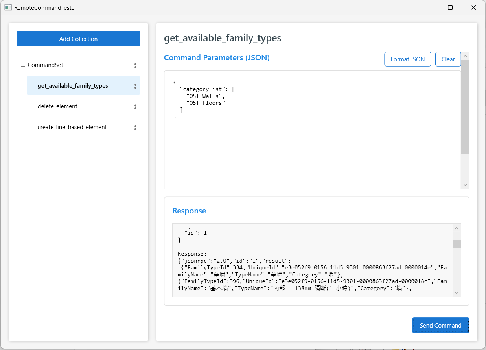

# Remote Command Tester

[English](README.md) | 简体中文

Remote Command Tester 是一个用于向 [Revit-MCP-Plugin](https://github.com/revit-mcp/revit-mcp-plugin) 发送远程命令的桌面应用程序。这个工具主要用于对 Revit-MCP-Plugin 的功能进行调试，提供了一个简单直观的方式来测试和验证远程命令的执行结果。

## 功能特点

- **直接触发**：不依赖 AI 对话客户端，可直接构建和发送命令
- **响应查看**：在界面中直接查看命令执行的响应结果
- **简洁界面**：直观的用户界面，易于上手和使用

## 安装说明

1. 下载最新的发行版本
2. 解压缩到您选择的位置
3. 运行 `RevitRemoteCommandTester.exe`

*注意：此应用基于 .NET Framework，可能需要安装相应版本的运行时环境。*

## 使用指南

### 创建和管理集合

1. 点击左上角的 "Add Collection" 按钮创建新的命令集合
2. 给集合命名，便于后续识别
3. 可以通过集合右侧的选项菜单 (⋮) 重命名或删除集合

### 添加和管理命令

1. 通过集合的选项菜单，选择 "Add Command" 添加新命令
2. 也可以在选择集合后，从信息面板中添加新命令
3. 命令可以通过其选项菜单 (⋮) 进行重命名或删除

### 编辑命令参数

1. 选择一个命令后，右侧面板会显示 JSON 参数编辑器
2. 输入符合 JSON 格式的参数
3. 使用 "Format JSON" 按钮可以格式化 JSON 参数
4. 使用 "Clear" 按钮可以清除参数

### 发送命令

1. 编辑完参数后，点击页面底部的 "Send Command" 按钮发送命令
2. 命令执行结果会显示在底部的响应面板中
3. 响应包含发送的命令和服务器返回的结果

### 数据持久化

应用程序会自动将所有集合和命令保存到应用目录下的 `data` 文件夹中。无需手动保存，重启程序后会自动加载上次的内容。

## 技术说明

- 使用 C# 和 WPF 开发的桌面应用程序
- 使用 Newtonsoft.Json 进行 JSON 处理
- 使用 TCP 通信发送 JSON-RPC 请求

## 故障排除

### 常见问题

**无法连接到服务器**

- 确保 Revit-MCP-Plugin 已正确安装，且开启了MCP服务

## 问题反馈

如发现任何问题或有改进建议，提交 Issue。